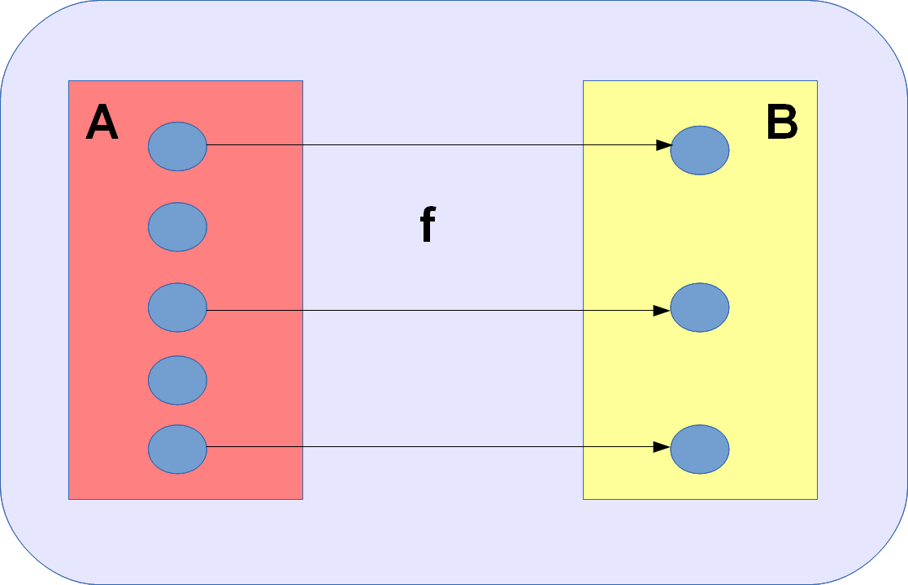
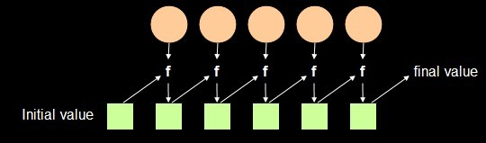

# HFunc
English | [中文](https://github.com/TangXiaoLv/HFunc/blob/master/README_CN.md) 

A fast and simple Java Higher-order function lib. Support serial compute and parallel compute.

Support
---
+ map
+ filter
+ reduce

Guide
---
	Example:
	//data collection
    List<Integer> c = new ArrayList<>();
    for (int i = 1; i < 101; i++) {
        c.add(i);
    }

[**map:**](https://research.google.com/archive/mapreduce.html)


```
Assumptions: Each applies function consumes 10ms
serial compute: 1078ms
parallel compute: 150ms
```

**filter:**



```
Assumptions: Each applies function consumes 10ms
serial compute: 1037ms
parallel compute: 159ms
```

[**reduce:**](https://research.google.com/archive/mapreduce.html)



```
Assumptions: Each applies function consumes 10ms
serial compute: 1061ms
parallel compute: 239ms
```

LICENSE
---

    Copyright 2016 XiaoLv Tang

    Licensed under the Apache License, Version 2.0 (the "License");
    you may not use this file except in compliance with the License.
    You may obtain a copy of the License at

        http://www.apache.org/licenses/LICENSE-2.0

    Unless required by applicable law or agreed to in writing, software
    distributed under the License is distributed on an "AS IS" BASIS,
    WITHOUT WARRANTIES OR CONDITIONS OF ANY KIND, either express or implied.
    See the License for the specific language governing permissions and
    limitations under the License.
